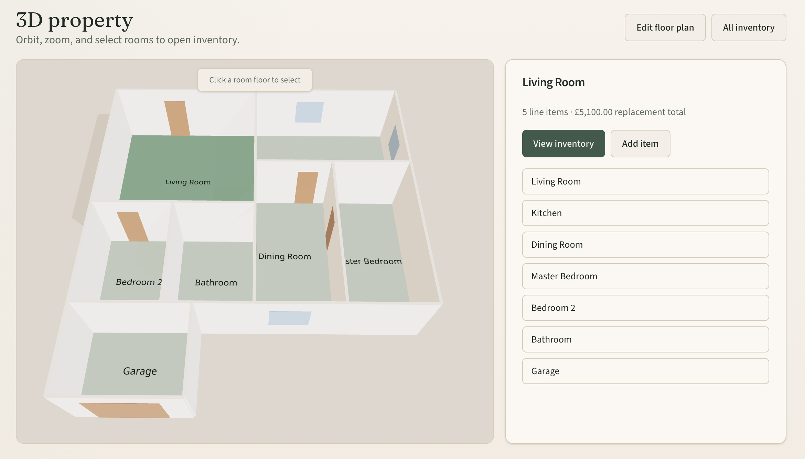

# HomeSpace

See your home as a living inventory. Draw a floor plan, walk the rooms in 3D, and keep a clear record of what you own and what it would cost to replace.

[](https://github.com/andrewbaisden/homespace/actions/workflows/ci.yml)
[](https://github.com/andrewbaisden/homespace/blob/main/package.json)
[](#license-and-responsible-use)

<p align="center">
  
</p>

## What it does

HomeSpace is a private home inventory for a single household. You sketch an orthogonal floor plan, open the same plan as an interactive dollhouse, and attach belongings to each room. Totals roll up from the replacement value you enter, so a room, a floor, or the whole property can be read at a glance.

It is built for the practical jobs around a home record: knowing what is in each room, exporting a list, and printing a summary you can keep with your paperwork. Figures stay labelled as your estimates.

## Highlights

- **Floor plans.** Draw walls, doors, windows, and room areas, then import or export the plan as JSON.
- **3D dollhouse.** Orbit, zoom, and select a room to open its inventory.
- **Inventory.** Add items, search and filter them, and see replacement totals in pounds.
- **Reports.** Download a CSV or print an insurance-style inventory summary.
- **Your account.** Sign in with email and password. Each property belongs to the account that created it.
- **A place to start.** The local seed includes a demo home at **12 Example Road**.

## Getting started

You need:

- [Node.js](https://nodejs.org/) 22
- [pnpm](https://pnpm.io/) 12
- [Docker](https://www.docker.com/), for the local Postgres database

```bash
pnpm install
cp .env.example .env
pnpm db:up
pnpm db:migrate
pnpm db:generate
pnpm db:seed
pnpm dev
```

Open [http://localhost:3000](http://localhost:3000).

Postgres is published on host port **5433**, so it can run beside another Postgres already using 5432.

### Try the demo

After seeding, sign in with:

- Email: `demo@homespace.app`
- Password: `demopassword`

Use this account only on your machine. It is a sample household, not a place to store a real inventory.

## Documentation

| Guide | What it covers |
| --- | --- |
| [Development](DEVELOPMENT.md) | Environment variables, scripts, tests, and deployment |
| [Architecture](ARCHITECTURE.md) | How the app is structured |
| [Decisions](DECISIONS.md) | Why the main technical choices were made |
| [Testing](TESTING.md) | Unit, component, and end-to-end tests |

## License and responsible use

Copyright © 2026 Andrew. All rights reserved.

This repository does not grant a licence to copy, modify, or redistribute the software. A public licence file will be added here if that changes.

HomeSpace helps you keep your own notes. It does not provide insurance, valuation, or legal advice.

- Replacement totals are **your figures × quantity**. They are not a professional valuation and they are not a guaranteed market value.
- Printed and CSV reports are summaries of what you entered. They are not insurance documents and they do not file a claim.
- Keep real household inventories on an account you control. Do not put personal property records into the shared demo login.
